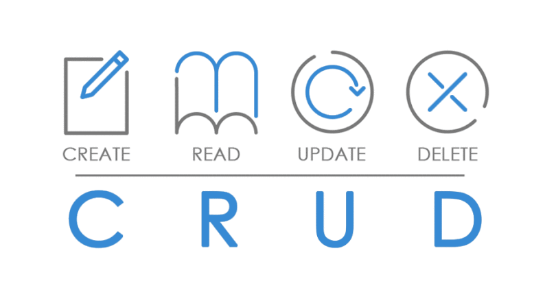
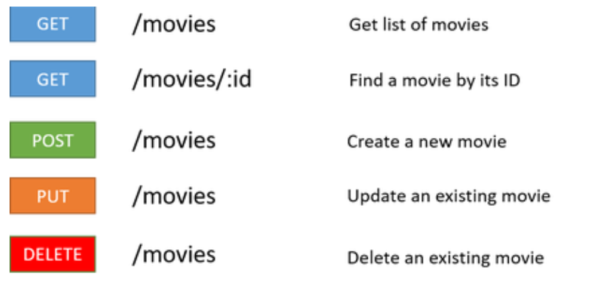
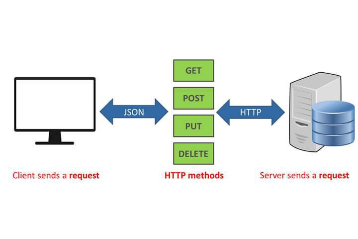
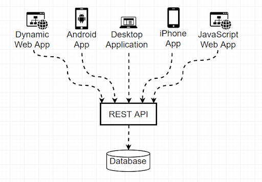
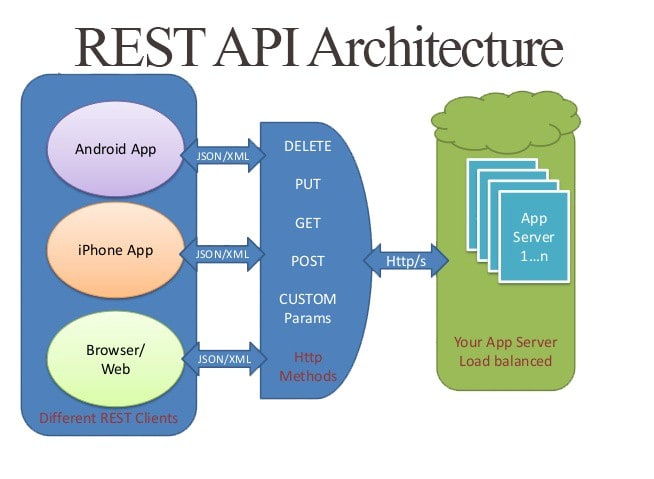
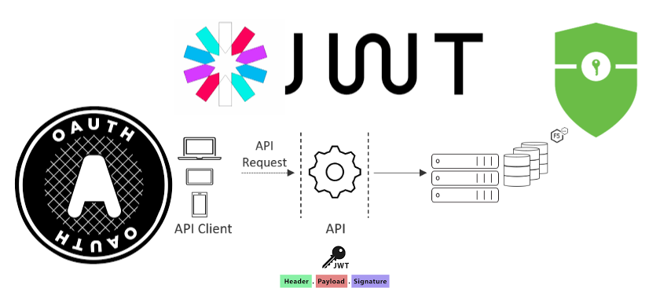
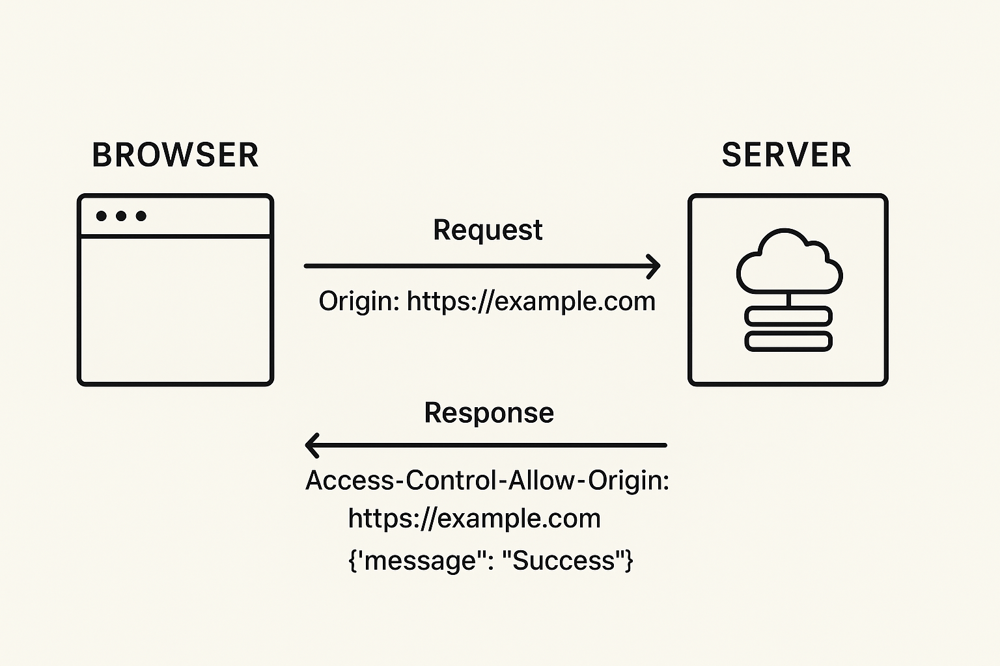
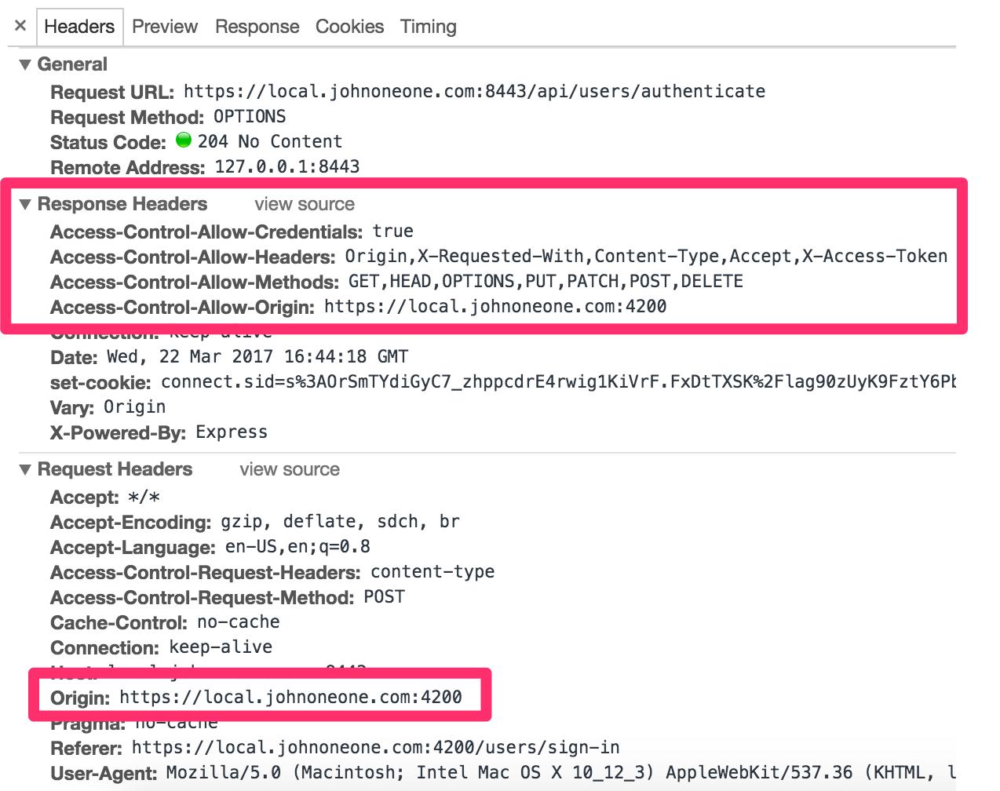

## API REST

Una **API (Application Programming Interface)** es un conjunto de reglas para comunicarte con un servicio.  
Una API **REST** (estilo arquitectónico) suele exponer **recursos** vía HTTP.

---

## Trabajando con APIs y CRUD

### APIs

> Una API es una interfaz de programación de aplicaciones (del inglés API: Application Programming Interface). Es un conjunto de rutinas que provee acceso a funciones de un determinado software. Son publicadas por los constructores de software para permitir acceso a características de bajo nivel o propietarias, detallando solamente la forma en que cada rutina debe ser llevada a cabo y la funcionalidad que brinda, sin otorgar información acerca de cómo se lleva a cabo la tarea. Son utilizadas por los programadores para construir sus aplicaciones sin necesidad de volver a programar funciones ya hechas por otros, reutilizando código que se sabe que está probado y que funciona correctamente. 
> [Wikipedia | Web API](https://es.wikipedia.org/wiki/Web_API)

En el contexto web, una API suele ser un servicio HTTP que expone **endpoints** y devuelve datos (muy frecuentemente **JSON**).

### Conceptos clave

- **Recurso**: entidad que gestionas (p. ej. `users`, `orders`, `products`)
- **Endpoint**: ruta para acceder a un recurso (p. ej. `/v1/users/123`)
- **Representación**: la “forma” del recurso (normalmente JSON)
- **Stateless**: el servidor no guarda estado de la sesión entre peticiones (en general)

### CRUD

> En informática, CRUD es el acrónimo de "Crear, Leer, Actualizar y Borrar" (del original en inglés: Create, Read, Update and Delete), que se usa para referirse a las funciones básicas en bases de datos o la capa de persistencia en un software.
> [Wikipedia | CRUD](https://es.wikipedia.org/wiki/CRUD)



Mapeo típico de CRUD en HTTP:

- Create:
  - Method (POST):
    - Respuesta 200 - OK
    - Respuesta 204 - Sin contenido
    - Respuesta 404 - No encontrado
    - Respuesta 409 - Conflicto, ya existe
- Read:
  - Method (GET):
    - Respuesta 200 - OK
    - Respuesta 404 - No encontrado
- Update:
  - Method (PUT/PATCH):
    - Respuesta 200 - OK
    - Respuesta 204 - Sin contenido
    - Respuesta 404 - No encontrado
- Delete:
  - Method (DELETE):
    - Respuesta 200 - OK
    - Respuesta 404 - No encontrado

### REST: transferencia de estado representacional

> > La transferencia de estado representacional (en inglés representational state transfer) o REST es un estilo de arquitectura software para sistemas hipermedia distribuidos como la World Wide Web. El término se originó en el año 2000, en una tesis doctoral sobre la web escrita por Roy Fielding, uno de los principales autores de la especificación del protocolo HTTP y ha pasado a ser ampliamente utilizado por la comunidad de desarrollo.
> [Wikipedia | REST](https://es.wikipedia.org/wiki/Transferencia_de_Estado_Representacional)

En la práctica, REST suele implicar:

- **Recursos** identificables por URLs
- Uso “razonable” de **métodos HTTP** y **códigos de estado**
- **Stateless** (sin estado de sesión en el servidor entre peticiones, en general)



#### Convenciones comunes

- **Colección vs elemento**
  - `GET /users` → lista usuarios
  - `GET /users/{id}` → un usuario
- **Crear**: `POST /users` → crea usuario
- **Actualizar**: `PATCH /users/{id}` (parcial) o `PUT /users/{id}` (reemplazo completo)
- **Borrar**: `DELETE /users/{id}`

#### Parámetros típicos

- **Query params**: filtrado, paginación, orden  
  - `GET /users?limit=20&offset=0&sort=-created_at`
- **Path params**: identifican un recurso  
  - `/users/123`

Ejemplos de peticiones HTTP:

```text
HTTP GET    http://www.appdomain.com/users
HTTP GET    http://www.appdomain.com/users?size=20&page=5
HTTP GET    http://www.appdomain.com/users/123
HTTP GET    http://www.appdomain.com/users/123/address

HTTP POST   http://www.appdomain.com/users
HTTP POST   http://www.appdomain.com/users/123/accounts

HTTP PUT    http://www.appdomain.com/users/123
HTTP PUT    http://www.appdomain.com/users/123/accounts/456

HTTP DELETE http://www.appdomain.com/users/123
HTTP DELETE http://www.appdomain.com/users/123/accounts/456

```

REST, que es la abreviación de Representational State Transfer, es un conjunto de restricciones que se utilizan para que las solicitudes HTTP cumplan con las directrizes definidas en la arquitectura. La ventaja que tiene es que REST funciona sobre el protocolo HTTP, con lo que es transversal a cualquier lenguaje de programación y plataforma, ya sea que estemos trabajando con JavaScript, Python, Java, C++, etc.





### Autenticación (muy frecuente)

- **API keys** (header `Authorization: Bearer ...` o `X-API-Key: ...`)
- **OAuth2** / tokens de acceso (muy común en APIs grandes)

Cuando estemos creando nuestras propias APIs en Python, hablaremos de cómo introducir autenticación en nuestro propio servidor.



### Buenas señales de una API “bien diseñada”

- Usa correctamente códigos HTTP (2xx, 4xx, 5xx)
- Documentación clara (OpenAPI/Swagger, ejemplos)
- Errores consistentes (JSON con campos tipo `error`, `message`, `code`)

Más sobre API REST:

- [Qué es API REST (IEBS)](https://www.iebschool.com/blog/que-es-api-rest-integrar-negocio-business-tech/)
- [API REST (Rock Content)](https://rockcontent.com/es/blog/api-rest/)
- [A beginner's guide to HTTP and REST (Tuts+)](https://code.tutsplus.com/es/tutorials/a-beginners-guide-to-http-and-rest--net-16340)
- [HTTP methods (RESTful API)](https://restfulapi.net/http-methods/)

---

## CORS: control de acceso HTTP

> CORS (*Cross-Origin Resource Sharing*) es un mecanismo basado en **cabeceras HTTP** que permite a un navegador consultar recursos en un **origen distinto** al del documento que originó la petición (dominio/puerto/protocolo).  
> [MDN | CORS](https://developer.mozilla.org/es/docs/Web/HTTP/Access_control_CORS)




### Recursos

- [Understanding CORS (Medium)](https://medium.com/@baphemot/understanding-cors-18ad6b478e2b)
- [CORS (Wikiwand)](https://www.wikiwand.com/en/Cross-origin_resource_sharing)
- [Tutorial CORS (HTML5 Rocks)](http://www.html5rocks.com/en/tutorials/cors/)
- [Using CORS (HTML5 Rocks)](https://www.html5rocks.com/en/tutorials/cors/)
- [Cross-origin resource sharing (Wikipedia)](https://en.wikipedia.org/wiki/Cross-origin_resource_sharing)
- [enable-cors.org](https://enable-cors.org/)
- [crossorigin.me (proxy)](https://crossorigin.me/)

---

## APIs de prueba (para experimentar)

- [Fake Store API](https://fakestoreapi.com/)
- [Dog API](https://dog.ceo/dog-api/)
- [RandomUser](https://randomuser.me/documentation)
- [JSONPlaceholder](https://jsonplaceholder.typicode.com/guide/)
- [Rick and Morty API](https://rickandmortyapi.com/api/character)
- [PokeAPI](https://pokeapi.co/)
- [List of open APIs (Wikipedia)](https://en.wikipedia.org/wiki/List_of_open_APIs)

Más ejemplos (algunos requieren registro / clave):

- [Shodan](https://www.shodan.io/)
- [OpenWeatherMap](https://openweathermap.org/)
- [Fitbit](https://dev.fitbit.com/eu)
- [Marvel](https://developer.marvel.com/)
- [SWAPI (Star Wars API)](https://swapi.dev/)
- [Reddit API](https://www.reddit.com/dev/api)
- [Deck of Cards API](https://deckofcardsapi.com/)
- [TheTVDB API](https://thetvdb.com/api-information)
- [Twitter/X API](https://developer.twitter.com/en/docs/twitter-api)
- [Guild Wars 2 API](https://api.guildwars2.com/v2)
- [Nutritionix API](https://www.nutritionix.com/business/api)

### Listados de APIs

- [apilist.fun](https://apilist.fun/)
- [public-apis (GitHub)](https://github.com/public-apis/public-apis)
- [ProgrammableWeb directory](https://www.programmableweb.com/apis/directory)

---

## Datos abiertos (fuentes útiles)

- [Portal de datos abiertos del Ayuntamiento de Madrid](https://datos.madrid.es/portal/site/egob/)
- [datos.gob.es](https://datos.gob.es/)
- [EMT Datos Abiertos](https://opendata.emtmadrid.es/)
- [European Data Portal](https://www.europeandataportal.eu/)
- [Open NASA](https://open.nasa.gov/open-data/)
- [Datos Abiertos de México](https://datos.gob.mx/)
- [Data.gov (EE. UU.)](https://www.data.gov/)

---

## Consumo de APIs

Este módulo se centra sobre todo en **consumir** APIs REST: construir peticiones HTTP (método, URL, cabeceras, query y body), interpretar **respuestas** y **códigos de estado**, y trabajar con datos (casi siempre **JSON**) desde **Python**, **notebooks**, **Postman** u otros clientes HTTP. No es el objetivo principal “renderizar una web” en el navegador; lo habitual aquí es **obtener o enviar datos**, **disparar acciones** en un servicio remoto e **integrar** el resultado en scripts, análisis o prototipos.

### Quién hace de cliente

- **Scripts y notebooks (Python + `requests`, etc.)**: el caso central de la unidad — automatizar llamadas, parsear JSON, reintentos, timeouts y errores.
- **Postman / clientes REST similares**: explorar la API a mano, repetir peticiones, guardar colecciones y variables de entorno.
- **Backends u otros servicios**: misma idea (HTTP + autenticación); el “cliente” puede ser otro servidor que llama a la API.
- **Navegador (JavaScript / `fetch`)**: relevante sobre todo si construyes una SPA que llama a una API en otro dominio; entonces entra **CORS** (sección anterior). Si solo consumes la API desde Python o Postman, **no te cruzas con CORS** en el mismo sentido (el navegador es quien aplica esa política entre orígenes).

### Qué defines tú al consumir

- **URL**: esquema (`https`), **host**, **path** del recurso (p. ej. `/v1/users/42`) y, si aplica, **querystring** (`?page=2&limit=10&sort=name`) para filtros, búsqueda o paginación.
- **Método HTTP** acorde a lo que permita la API (GET para leer, POST para crear, etc.).
- **Cabeceras**: `Accept: application/json`; `Content-Type: application/json` cuando envías body; `Authorization` o API key si el servicio lo exige.
- **Cuerpo** en POST/PUT/PATCH: normalmente JSON con la forma que documente el proveedor.

La **documentación** de la API (portal del desarrollador, OpenAPI/Swagger) es el contrato: campos obligatorios y opcionales, **versionado** en la ruta (`/v1`, `/v2`), límites de uso (**rate limiting**) y políticas de autenticación.

### JSON en APIs (puente con el resto de la unidad)

En APIs modernas, el cuerpo de respuesta (y a menudo el de petición) suele ser **JSON**: objetos (`{}`), listas (`[]`), strings, números, booleanos y `null`.

Para ejemplos ejecutables con `requests`, abre **`04_Llamadas_API_desde_Python.ipynb`**.

Para practicar **errores reales** (4xx/5xx, timeouts, no-JSON, conexión), abre **`05_Gestión_errores_timeouts.ipynb`**.
